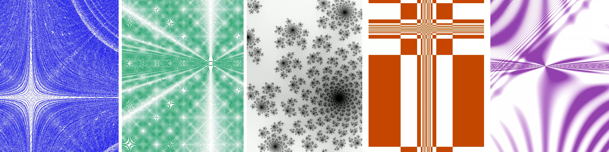

    
    <h1>KGraph</h1>

 

_Want to go straight to the point? __[→ Try it for yourself!](https://kaapporaivio.fi/graph?demo=1)___

More information available __[here](https://kaapporaivio.fi/graph/about)__